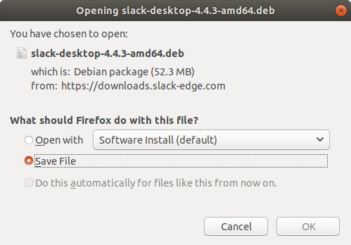
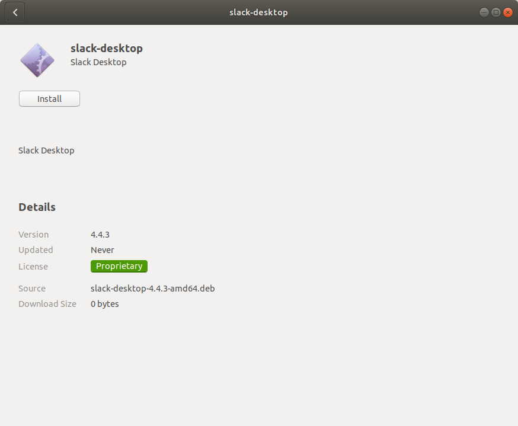
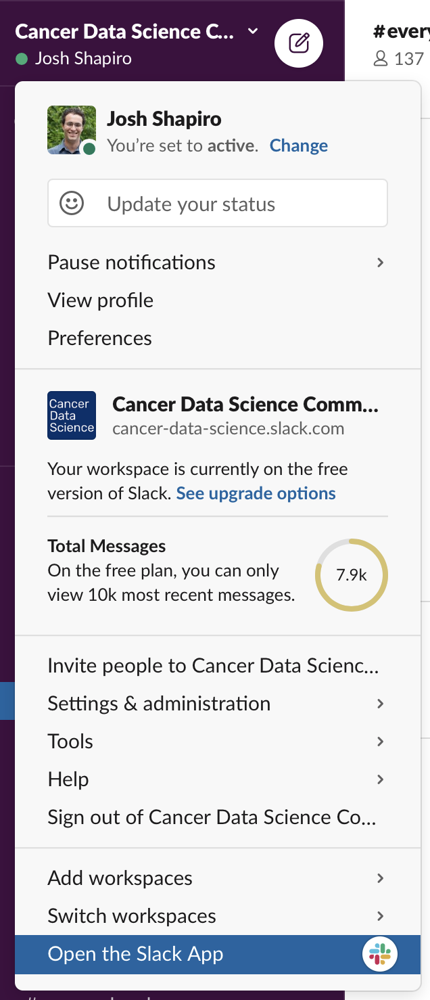

*Note: These instructions were tested on Ubuntu 18.04 LTS.
Our instructions generally follow the software provider's instructions, which we link below.
For other Linux distros, please see the instructions from the software providers.*

<!-- START doctoc generated TOC please keep comment here to allow auto update -->
<!-- DON'T EDIT THIS SECTION, INSTEAD RE-RUN doctoc TO UPDATE -->
**Table of Contents**

- [Slack](#slack)
  - [New Slack Installation](#new-slack-installation)
  - [Logging in to the Cancer Data Science workspace](#logging-in-to-the-cancer-data-science-workspace)

<!-- END doctoc generated TOC please keep comment here to allow auto update -->

## Slack

### New Slack Installation

If you do not already have Slack installed, you can download it at <https://slack.com/downloads/linux>.
Depending on your distribution, download either the `deb` or `rpm` file.
The following instructions are using the DEB installer on Ubuntu ([Instructions from Slack](https://slack.com/help/articles/212924728-Download-Slack-for-Linux--beta-)).

Save the `deb` file to your computer.

Double-click the `deb` file to open the Ubuntu Software Center and then select `Install`.

To open Slack, search your computer for Slack and double-click the icon.

### Logging in to the Cancer Data Science workspace

Open <http://ccdatalab.org/slack> in your browser.
If you have not created an account, follow the prompts to do so.
You will be required to verify your email address first.
Follow the link in the email to set up your account.
Please use your full name in your profile, and don't forget to set a unique password!

After you login, you will see the Slack interface in the browser, but you probably want to open the app for ease of use and the complete feature set.
In the upper left of the window, click on the words **Cancer Data Science** to open the menu, then select "Open the Slack App"

The Slack app you installed should open to the Cancer Data Science Community workspace and you should be all set.
After you have been added to the training-specific channel, say "Hi" and introduce yourself to everyone!

If you are new to Slack, you can get familiar with the interface and features by having a conversation with Slackbot (Slack's resident chatbot) or with yourself.
You can find Slackbot (and yourself) in the left panel, under "Direct Messages".

