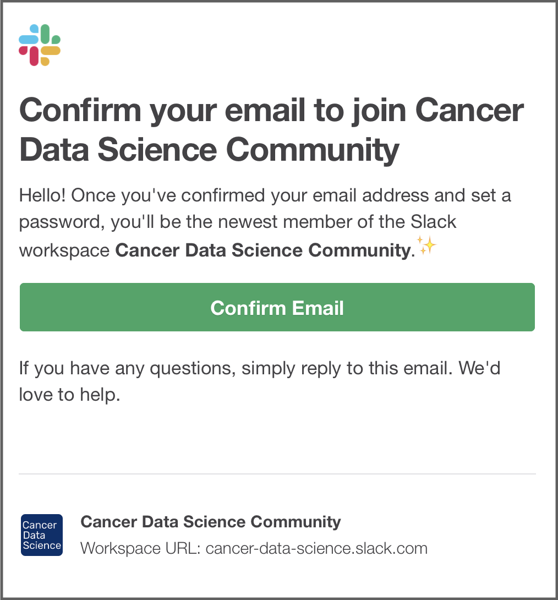

<!-- START doctoc generated TOC please keep comment here to allow auto update -->
<!-- DON'T EDIT THIS SECTION, INSTEAD RE-RUN doctoc TO UPDATE -->
**Table of Contents**

- [Slack](#slack)
  - [New Slack Installation](#new-slack-installation)
  - [Logging in to the Cancer Data Science workspace](#logging-in-to-the-cancer-data-science-workspace)

<!-- END doctoc generated TOC please keep comment here to allow auto update -->

## Slack

### New Slack Installation

If you do not already have Slack, you can download it at <https://slack.com/downloads/mac>.
You have the option to directly download the app from the Slack website there, or install it via the Mac App Store.
If you download it directly, you will need to open the `.dmg` file and drag the Slack app to your Applications folder, as depicted in the window that appears.

Open Slack from your Applications folder.
If you downloaded directly, there may be a warning about opening a file that was downloaded from the internet, so give the required permission.
You may be prompted to login, but ignore that for the moment.

### Logging in to the Cancer Data Science workspace

Open <http://ccdatalab.org/slack> in your browser.
If you have not created an account, follow the prompts to do so.
You will be required to verify your email address first.
Follow the link in the email to set up your account.
Please use your full name in your profile, and don't forget to set a unique password!

After you login, you will see the Slack interface in the browser, but you probably want to open the app for ease of use and the complete feature set.
In the upper left of the window, click on the words **Cancer Data Science** to open the menu, then select "Open the Slack App"

The Slack app you installed should open to the Cancer Data Science Community workspace and you should be all set.
After you have been added to the training-specific channel, say "Hi" and introduce yourself to everyone!

If you are new to Slack, you can get familiar with the interface and features by having a conversation with Slackbot (Slack's resident chatbot) or with yourself.
You can find Slackbot (and yourself) in the left panel, under "Direct Messages".

One more thing: if you end up using the voice or video calling functionality that Slack provides, you may be asked to grant the app permission to use your microphone and videocamera.

