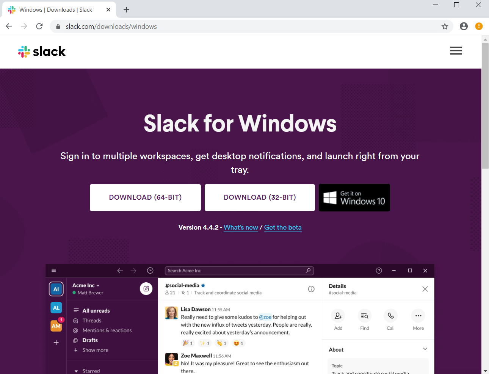

## Slack

Download the 64-bit Slack application from:
https://slack.com/downloads/instructions/windows

Click on the `SlackSetUp.exe` file this downloads when it pops up in the lower left corner.
Or find it most likely in the `Downloads` folder and click on it there.

Join Cancer Data Science Slack by using [this link](https://ccdatalab.org/slack).

Please use your full name in your profile, and don't forget to set a unique password!

After you login, you will see the Slack interface in the browser, but you probably want to open the app for ease of use and the complete feature set.
In the upper left of the window, click on the words **Cancer Data Science** to open the menu, then select "Open the Slack App".
Windows may ask `Did you mean to switch apps?`; say `Yes`.

The Slack app you installed should open to the Cancer Data Science Community workspace and you should be all set.
After you have been added to the training-specific channel, say "Hi" and introduce yourself to everyone!

If you are new to Slack, you can get familiar with the interface and features by having a conversation with Slackbot (Slack's resident chatbot) or with yourself.
You can find Slackbot (and yourself) in the left panel, under "Direct Messages".

